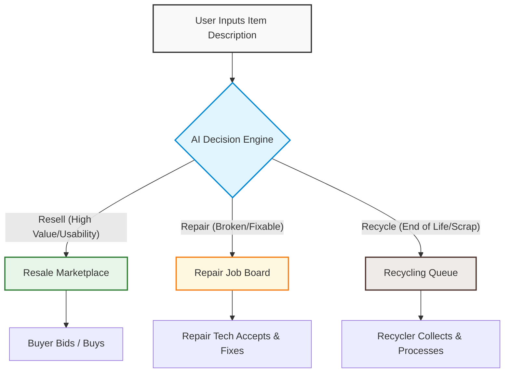
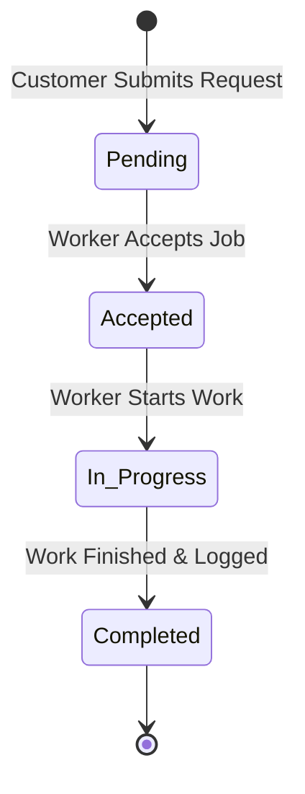

# ♻️ Reloop Plus
> **AI-Powered Circular Economy Platform for Resale, Repair & Recycling**

[-61DAFB?style=for-the-badge&logo=react&logoColor=black)](https://reactjs.org/)
[](https://nodejs.org/)
[](https://www.mongodb.com/)
[](https://aistudio.google.com/)
[](LICENSE)

Reloop Plus is a Generative AI-powered circular economy platform designed to help households make smart, sustainable decisions about unused, broken, or obsolete items. Rather than leaving items to collect dust or disposing of them prematurely, Reloop Plus analyzes each item's usability and condition in natural language to recommend the most optimal sustainability path: **Resale**, **Repair**, or **Recycling**.

---

## 🌍 The Problem & The Reloop Solution

### 🚨 The Challenge
Households frequently accumulate unused or damaged goods. Traditional platforms offer resale, repair, or recycling independently, placing the burden of choice entirely on the user. Without guidance, this uncertainty leads to:
* **Premature waste:** Scrapping repairable goods.
* **Economic loss:** Discarding high-value items instead of reselling.
* **Inefficient recycling:** Throwing recyclable parts into standard trash.

### 💡 The Reloop Solution
Reloop Plus introduces an **AI-driven decision layer** before execution. Users simply describe their item, and the AI determines the single best course of action based on usability, condition, market value, and environmental impact. Once approved, the platform seamlessly connects the user to the corresponding transaction or service workflow.

---

## 🤖 System Architecture & Workflows

### 1. Unified User Flow


### 2. Service Job Lifecycle
Both the Repair and Recycling streams follow a structured state-machine flow, tracked in real-time by both the customer and the service worker.



---

## ✨ Key Features

### 🧠 Generative AI Decision Engine
* **Multimodal / Natural Language Parsing:** Evaluates free-text inputs detailing item categories, ages, and conditions.
* **Dual AI Provider Support:** Works with **Google Gemini 1.5 Flash** (cloud) or **Ollama Llama 3.2** (local/VPS).
* **Robust Heuristic Fallback:** If the AI provider is unavailable, an intelligent heuristic engine guarantees uninterrupted service.

### 🍃 MongoDB Persistence & Mongoose Data Layer
* **Production Database:** Uses MongoDB Atlas (or local MongoDB) with full schema validation for users, items, bids, and requests.
* **Auto-Seeding:** Automatically seeds demo users and marketplace items on initial connection for instant out-of-the-box testing.
* **Zero-Config Fallback:** Seamlessly falls back to an in-memory mock store if no database URI is provided during local development.

### 💰 Bid-Driven Resale Marketplace
* **Seller Dashboards:** List items, view incoming offers, accept or reject bids.
* **Smart Bidding Safeguards:** Prevents self-bidding and auto-delists items once a bid is accepted.

### 🛠️ Repair & Recycle Dispatch
* **Repair Pipeline:** Connects users with local repair technicians with live progress tracking.
* **Recycling Pipeline:** Estimates recycle values and logs environmental material recovery.
* **Worker Dashboard:** A unified portal where registered technicians and recyclers claim and update active service contracts.

---

## 🛠️ Tech Stack

| Technology | Category | Role in Reloop Plus |
| :--- | :--- | :--- |
| **React 18 (Vite)** | Frontend | Single Page Application framework with dynamic dashboard UI |
| **Node.js / Express** | Backend | RESTful API server handling business logic, auth, and pipelines |
| **MongoDB / Mongoose** | Database | Cloud (MongoDB Atlas) or local database with persistent schemas |
| **Google Gemini API** | Cloud AI | Ultra-fast structured AI recommendation engine |
| **Ollama (Llama 3.2)**| Local AI | Optional self-hosted sovereign LLM for local evaluation |
| **Vanilla CSS** | Styling | Modern, green-themed responsive UI with smooth micro-animations |

---

## 📂 Project Structure

```
reloop-plus/
├── backend/
│   ├── db/              # Database models (Mongoose schemas) & unified store
│   │   ├── models.js    # User, ResaleItem, Bid, RepairRequest, RecycleRequest
│   │   └── store.js     # Unified MongoDB data store with memory fallback
│   ├── routes/          # REST endpoints (auth, resale, repair, recycle, ai, user)
│   ├── services/        # AI orchestration layer (Gemini & Ollama prompts)
│   ├── utils/           # Validation and formatting helpers
│   ├── server.js        # Express server entrypoint
│   └── package.json     # Node.js backend dependencies
│
├── frontend/
│   ├── src/
│   │   ├── components/  # Reusable UI widgets (cards, forms, history, marketplace)
│   │   ├── pages/       # Dashboard, Login, Worker view
│   │   ├── App.jsx      # Navigation, auth state, and router setup
│   │   ├── main.jsx     # Frontend entrypoint
│   │   └── styles.css   # Global custom styling & green theme variables
│   ├── vercel.json      # Vercel SPA routing rewrite config
│   └── package.json     # React frontend dependencies
│
├── DEPLOYMENT.md        # Comprehensive cloud deployment guide (Vercel + Render + MongoDB)
├── README.md            # Project overview & documentation
└── .gitignore           # Ignored files and local secrets
```

---

## 🚀 Getting Started

### Prerequisites
* [Node.js](https://nodejs.org/) (v18 or higher)
* [MongoDB](https://www.mongodb.com/) (Local instance or free [MongoDB Atlas](https://www.mongodb.com/cloud/atlas) cluster)
* *(Optional)* Free [Google Gemini API Key](https://aistudio.google.com/) for AI recommendations

### Step 1: Configure Backend Environment
1. Navigate to `backend`:
   ```bash
   cd backend
   ```
2. Copy `.env.example` to `.env`:
   ```bash
   cp .env.example .env
   ```
3. Set your connection string in `.env`:
   ```env
   PORT=3001
   CLIENT_URL=http://localhost:5173
   MONGODB_URI=mongodb+srv://<username>:<password>@cluster0.xxxxx.mongodb.net/reloop?retryWrites=true&w=majority
   AI_PROVIDER=gemini
   GEMINI_API_KEY=your_gemini_api_key
   ```
   *(If `MONGODB_URI` is left blank, the backend automatically runs with the high-performance in-memory store).*

4. Install dependencies and start the backend:
   ```bash
   npm install
   npm start
   ```
   The backend will listen at `http://localhost:3001`.

### Step 2: Configure and Start Frontend
1. In a new terminal, navigate to `frontend`:
   ```bash
   cd frontend
   ```
2. Install dependencies:
   ```bash
   npm install
   ```
3. Start the Vite dev server:
   ```bash
   npm run dev
   ```
   Open your browser at `http://localhost:5173`.

---

## 🌐 Cloud Deployment (Live Link)

For full step-by-step instructions to deploy the project with a public live URL:
* **Frontend:** Deployed on **[Vercel](https://vercel.com/)**
* **Backend:** Deployed on **[Render](https://render.com/)**
* **Database:** Hosted on **[MongoDB Atlas](https://www.mongodb.com/cloud/atlas)**

👉 See **[DEPLOYMENT.md](DEPLOYMENT.md)** for the complete guide.

---

## 🔒 Pre-Seeded Test Credentials

The database auto-seeds these accounts on first startup:

* **Customer Account:** `user@example.com` / `password123` (Role: `USER`)
* **Worker Account:** `worker@example.com` / `password123` (Role: `WORKER`)

---

## 📄 License
This project is licensed under the MIT License.
