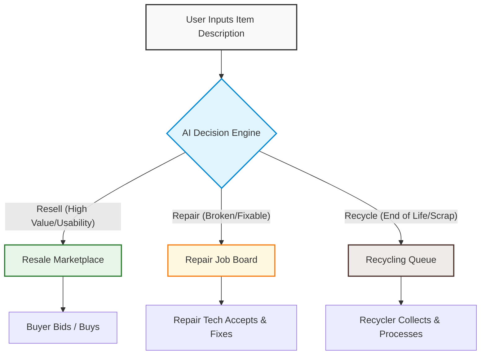
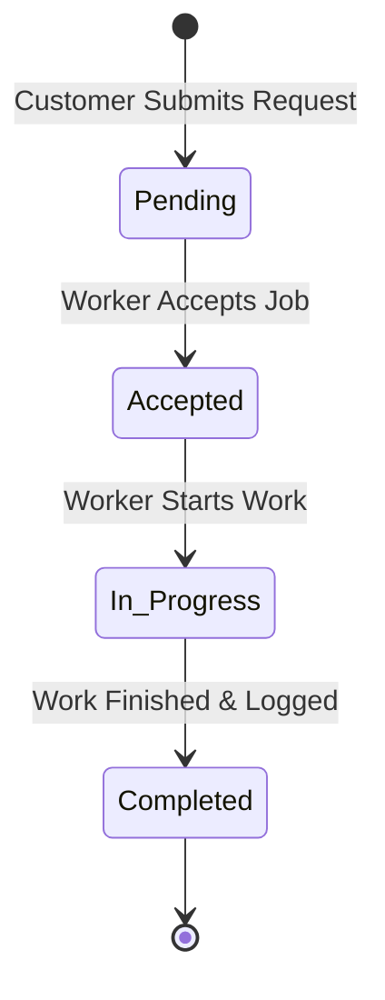

# ♻️ Reloop Plus
> **AI-Powered Circular Economy Platform for Resale, Repair & Recycling**

[-61DAFB?style=for-the-badge&logo=react&logoColor=black)](https://reactjs.org/)
[](https://nodejs.org/)
[](https://ollama.com/)
[](LICENSE)

Reloop Plus is a Generative AI-powered web application designed to help households make smart, sustainable decisions about unused, broken, or obsolete items. Rather than leaving items to collect dust or disposing of them prematurely, Reloop Plus acts as a decision-support layer, analyzing each item's usability and condition in natural language to recommend the most optimal sustainability path: **Resale**, **Repair**, or **Recycling**.

---

## 🌍 The Problem & The Reloop Solution

### 🚨 The Challenge
Households frequently accumulate unused or damaged goods. Traditional platforms offer resale, repair, or recycling independently, placing the burden of choice entirely on the user. Without guidance, this uncertainty leads to:
* **Premature waste:** Scrapping repairable goods.
* **Economic loss:** Discarding high-value items instead of reselling.
* **Inefficient recycling:** Throwing recyclable parts into standard trash.

### 💡 The Reloop Solution
Reloop Plus introduces an **AI-driven decision layer** before execution. Users simply describe their item, and the AI determines the single best course of action based on usability, condition, market value, and environmental impact. Once approved, the platform seamlessly connects the user to the corresponding transaction or service workflow.

---

## 🤖 System Architecture & Workflows

### 1. Unified User Flow
The diagram below shows how a user interacts with the system, from submitting an item description to final execution across the three service pipelines.



### 2. Service Job Lifecycle
Both the Repair and Recycling streams follow a structured state-machine flow, tracked in real-time by both the customer and the service worker.



---

## ✨ Key Features

### 🧠 Generative AI Decision Engine
* **Natural Language Parsing:** Evaluates free-text inputs detailing item categories, ages, and conditions.
* **Defensive Prompting:** Strict prompt constraints enforce a structured JSON schema response from the LLM.
* **Robust Fallback:** If the local LLM endpoint is unreachable, a regex-based heuristics engine steps in to guarantee uninterrupted service.

### 💰 Bid-Driven Resale Marketplace
* **Seller Dashboards:** List items, set floor bids, and review active offers.
* **Smart Bidding Safeguards:** Prevents self-bidding and enforces minimum bid increments.
* **Auto-Archiving:** Items automatically delist once a bid is accepted.

### 🛠️ Repair & Recycle Dispatch
* **Repair Pipeline:** Connects users with local repair technicians. 
* **Recycling Pipeline:** Estimates recycle values and queues scrap pick-ups.
* **Worker Dashboard:** A unified portal where registered service technicians and recyclers claim and update active service contracts.

---

## 🛠️ Tech Stack

| Technology | Category | Role in Reloop Plus |
| :--- | :--- | :--- |
| **React (Vite)** | Frontend | Single Page Application framework with stateful dash designs |
| **Node.js / Express** | Backend | RESTful API server handling business logic and service states |
| **Ollama (Llama 3.2)**| AI | Local LLM host for item evaluation and route selection |
| **Vanilla CSS** | Styling | Premium, green-themed responsive UI with smooth micro-animations |
| **In-Memory Store** | Storage | Thread-safe mock database for instant state verification & local-first testing |

---

## 📂 Project Structure

```
reloop-plus/
├── backend/
│   ├── routes/          # API endpoint routers (auth, repair, resale, recycle)
│   ├── services/        # AI orchestration layer (Ollama configuration & prompts)
│   ├── utils/           # Validation and formatting helpers
│   ├── server.js        # Server entrypoint
│   └── package.json     # Node.js dependencies
│
├── frontend/
│   ├── src/
│   │   ├── components/  # Reusable UI widgets (cards, forms, history)
│   │   ├── pages/       # Portal views (Dashboard, Login, Worker view)
│   │   ├── App.jsx      # Navigation, auth state, and router setup
│   │   ├── main.jsx     # Frontend entrypoint
│   │   └── styles.css   # Global custom styling & green theme variables
│   │
│   └── package.json     # React dependencies
│
├── README.md            # Documentation
└── .gitignore           # Ignored builds/modules
```

---

## 🚀 Getting Started

### Prerequisites
* [Node.js](https://nodejs.org/) (v16 or higher)
* [Ollama](https://ollama.com/) (Required for local AI recommendations)

### Phase 1: Setting up the Local AI
1. Download and install **Ollama**.
2. Run the Llama 3.2 model in your terminal:
   ```bash
   ollama run llama3.2
   ```
   *Note: If you run a different model, update the `OLLAMA_MODEL` environment variable in the backend.*

### Phase 2: Start the Backend
1. Navigate to the backend directory:
   ```bash
   cd backend
   ```
2. Install dependencies:
   ```bash
   npm install
   ```
3. Start the Express server:
   ```bash
   npm start
   ```
   The API will listen at `http://localhost:3001`.

### Phase 3: Start the Frontend
1. Open a new terminal and navigate to the frontend directory:
   ```bash
   cd ../frontend
   ```
2. Install dependencies:
   ```bash
   npm install
   ```
3. Start the development server:
   ```bash
   npm run dev
   ```
   Access the app at `http://localhost:5173`.

---

## 🔒 Authentication Roles & Credentials

For easy local testing, you can use these predefined user roles:

* **Standard User:** Can submit descriptions, bid in the marketplace, and create service/recycling requests.
* **Worker (Repair Tech / Recycler):** Can accept and progress requests through the job portal.

---

## 🔮 Future Roadmap
- [ ] **Live Payment Gateway:** Escrow-based bidding payments.
- [ ] **Geolocation Services:** GPS-based routing for repair technician and recycler matching.
- [ ] **Carbon Accounting:** Reward users with carbon credits for choosing repairs and recycling.
- [ ] **Multimodal AI:** Image-based item condition assessment.
